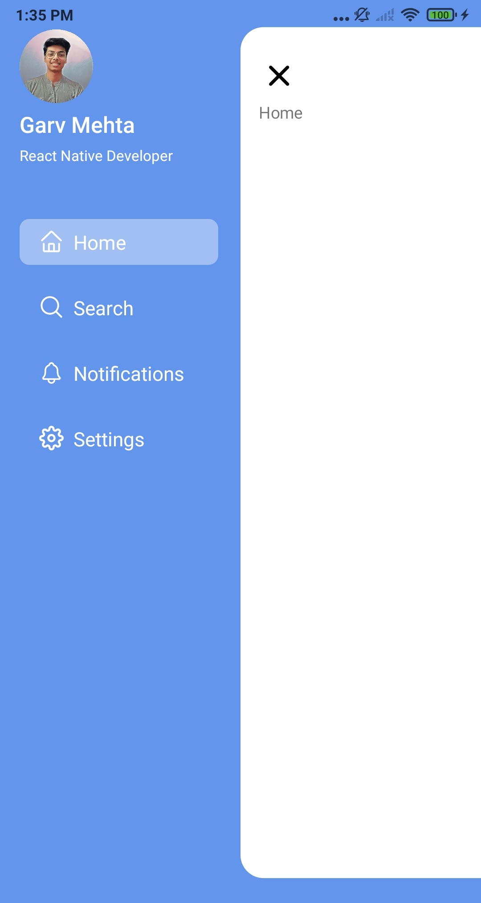

# React Native Custom Drawer


## Screenshot


                                                                                                               
## Preview


## Run Locally

Clone the project

```bash
  git clone https://github.com/garvmehta/react_native_drawer.git
```

Go to the project directory

```bash
  cd react_native_drawer
```

Install dependencies

```bash
  npm install
```

Start React Native App

```bash
  npm run android
```


## 🛠 Skills
React Native, Typescript, NPM


## Authors

- [@garvmehta](https://www.github.com/garvmehta)

